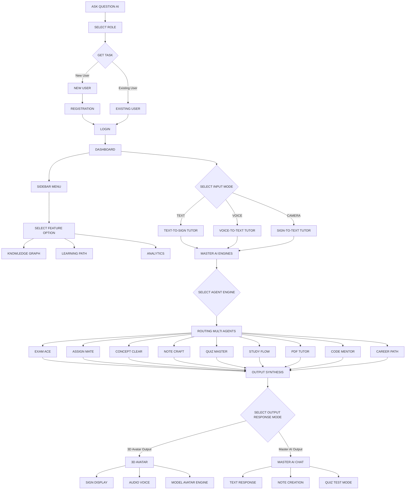

# 🔄 EduVerse AI — Complete System Process Flowchart

```mermaid
graph TD
    %% ── EXACT EDUVERSE AI SYSTEM FLOWCHART ─────────────────
    Top["ASK QUESTION AI"] --> Role["SELECT ROLE"]
    Role --> TaskCheck{"GET TASK"}

    %% User Auth Branch
    TaskCheck -->|New User| NewUser["NEW USER"]
    NewUser --> Reg["REGISTRATION"]
    Reg --> Login["LOGIN"]
    Login --> Dash["DASHBOARD"]

    TaskCheck -->|Existing User| ExistUser["EXISTING USER"]
    ExistUser --> Login

    %% Sidebar Branch
    Dash --> SideMenu["SIDEBAR MENU"]
    SideMenu --> SelectFeat["SELECT FEATURE OPTION"]
    SelectFeat --> KG["KNOWLEDGE GRAPH"]
    SelectFeat --> LP["LEARNING PATH"]
    SelectFeat --> Ana["ANALYTICS"]

    %% Input Mode Branch
    Dash --> InputModeCheck{"SELECT INPUT MODE"}
    InputModeCheck -->|TEXT| TextMode["TEXT-TO-SIGN TUTOR"]
    InputModeCheck -->|VOICE| VoiceMode["VOICE-TO-TEXT TUTOR"]
    InputModeCheck -->|CAMERA| CamMode["SIGN-TO-TEXT TUTOR"]

    TextMode & VoiceMode & CamMode --> MasterEngine["MASTER AI ENGINES"]
    MasterEngine --> AgentCheck{"SELECT AGENT ENGINE"}

    AgentCheck --> RouteAgents["ROUTING MULTI AGENTS"]

    %% 9 Neural Agents
    RouteAgents --> A1["EXAM ACE"]
    RouteAgents --> A2["ASSIGN MATE"]
    RouteAgents --> A3["CONCEPT CLEAR"]
    RouteAgents --> A4["NOTE CRAFT"]
    RouteAgents --> A5["QUIZ MASTER"]
    RouteAgents --> A6["STUDY FLOW"]
    RouteAgents --> A7["PDF TUTOR"]
    RouteAgents --> A8["CODE MENTOR"]
    RouteAgents --> A9["CAREER PATH"]

    A1 & A2 & A3 & A4 & A5 & A6 & A7 & A8 & A9 --> OutputSynth["OUTPUT SYNTHESIS"]

    OutputSynth --> OutputCheck{"SELECT OUTPUT RESPONSE MODE"}

    %% Output Response Modes
    OutputCheck -->|3D Avatar Output| AvMode["3D AVATAR"]
    AvMode --> SignDisp["SIGN DISPLAY"]
    AvMode --> AudVoice["AUDIO VOICE"]
    AvMode --> AvEngine["MODEL AVATAR ENGINE"]

    OutputCheck -->|Master AI Output| ChatMode["MASTER AI CHAT"]
    ChatMode --> TextResp["TEXT RESPONSE"]
    ChatMode --> NoteCreate["NOTE CREATION"]
    ChatMode --> QuizTest["QUIZ TEST MODE"]
```
