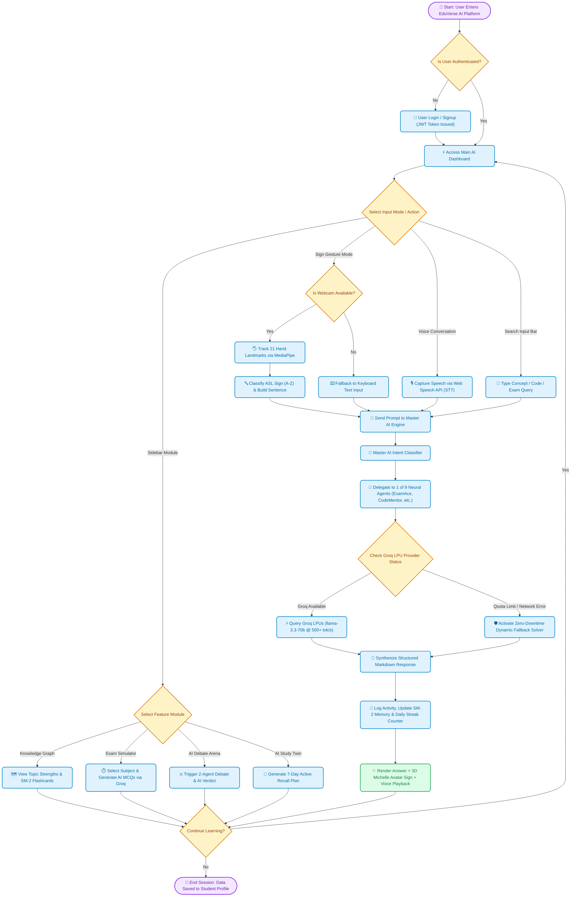

# 🔄 EduVerse AI — Complete System Process Flowchart Diagram

Below is the complete, end-to-end operational process flowchart for the **EduVerse AI** platform, featuring decision logic, multi-modal input processing, agent routing, Groq LPU execution, zero-downtime fallbacks, and 3D sign avatar synthesis.

---

