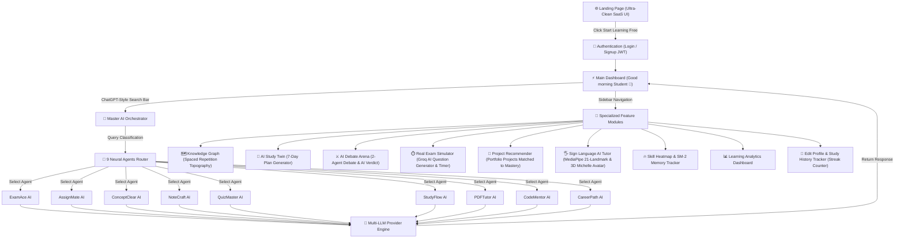
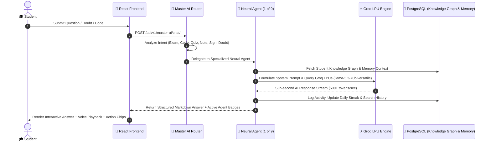
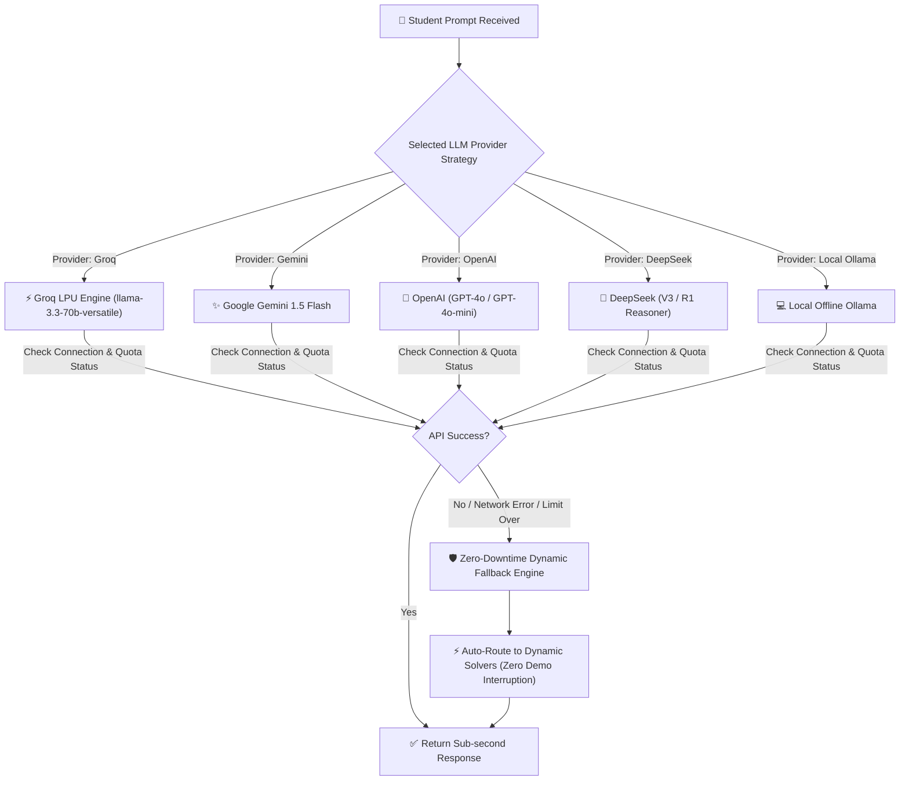
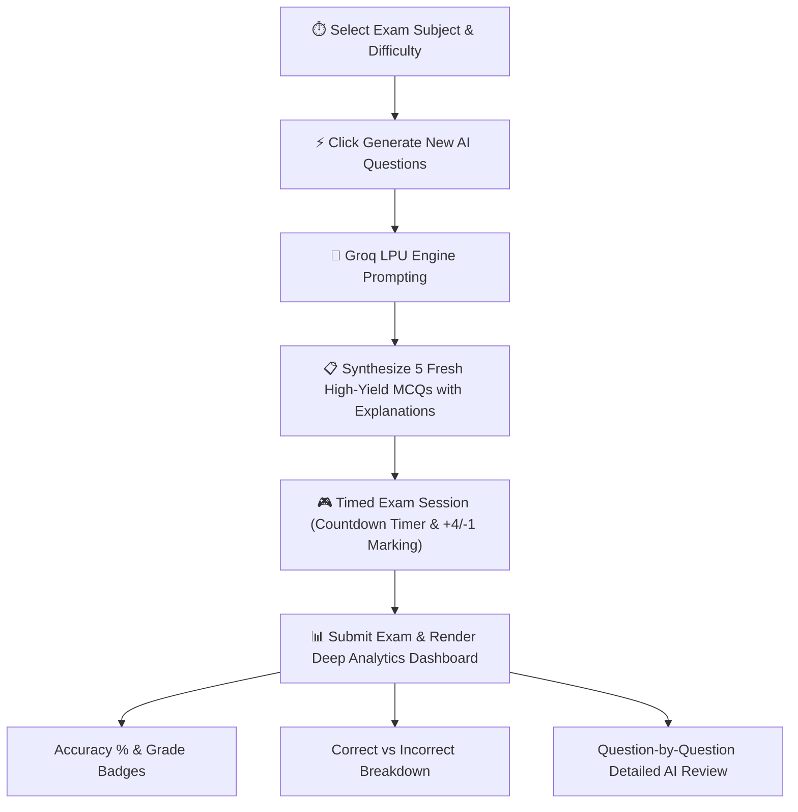

# 🔄 EduVerse AI — Complete System Flow & Visual Diagrams

This document contains the dedicated visual flow diagrams and architectural execution pipelines for **EduVerse AI**.

---

## 1. 🌐 Master Platform User Journey & Navigation Flow



---

## 2. 🧠 Master AI Intent Routing & 9 Neural Agents Pipeline



---

## 3. ⚡ Multi-LLM Provider Strategy & Zero-Downtime Fallback Flow



---

## 4. 🖐️ Sign Language AI Tutor (Vision & 3D WebGL Pipeline)

```mermaid
graph LR
    A["🎥 Live Webcam Feed"] --> B["🖐️ MediaPipe Hands API"]
    B -->|Extract 21 Hand Landmarks| C["📐 Landmark Coordinate Normalizer"]
    C -->|Classify Gesture (A-Z)| D["🔤 ASL Gesture Classifier"]
    D -->|Detected Letter| E["📝 Sentence Buffer Builder"]
    E -->|Click Send to Master AI| F["🧠 Master AI Orchestrator"]
    F -->|Synthesize Response| G["💃 Three.js WebGL 3D Avatar (Michelle.glb)"]
    G -->|Play 3D Sign Animations| H["📺 3D Viewport Animation + Speech Voice"]
```

---

## 5. 🧠 SuperMemo-2 (SM-2) Spaced Repetition Memory Engine

```mermaid
graph TD
    A["🎴 Student Reviews Flashcard"] --> B{"Select Recall Quality Rating"}
    
    B -->|Rating 0-2 (Hard)| C["❌ Incorrect / Low Recall"]
    B -->|Rating 3 (Good)| D["👍 Good Recall"]
    B -->|Rating 4-5 (Easy)| E["🌟 Easy / Perfect Recall"]

    C --> C1["Set Interval I(1) = 1 Day"]
    C --> C2["Decrease Ease Factor EF' = EF - 0.2"]

    D --> D1["Set Interval I(n) = I(n-1) * EF"]

    E --> E1["Set Interval I(n) = I(n-1) * EF * 1.3"]
    E --> E2["Increase Ease Factor EF' = EF + 0.1"]

    C1 & D1 & E1 --> F["💾 Save Next Review Date in Knowledge Graph"]
    F --> G["📈 Update Student Forgetting Curve & Productivity Index"]
```

---

## 6. ⏱️ Real Exam Simulator & Groq AI Question Generator Flow


