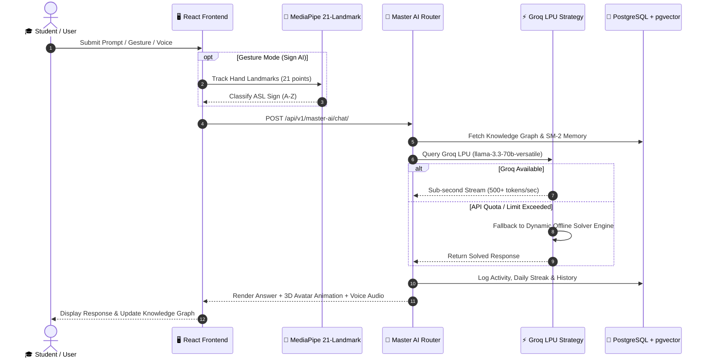
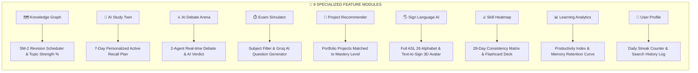

# 🏗️ EduVerse AI — System Architecture & Flow Diagrams

```mermaid
graph TB
    %% ── USER & CLIENT INTERFACE LAYER ──────────────────────────────────
    subgraph CLIENT_LAYER ["🎨 PRESENTATION & FRONTEND LAYER (React 18 + Vite + TS)"]
        UI["🖥️ EduVerse AI SaaS Dashboard UI"]
        Webcam["🎥 MediaPipe Hands API (21 Hand Landmarks)"]
        Avatar3D["💃 Three.js WebGL 3D Avatar (Michelle.glb)"]
        VoiceEngine["🎙️ Web Speech API (STT & TTS Engine)"]
    end

    %% ── MASTER AI & MULTI-AGENT ORCHESTRATION LAYER ────────────────────
    subgraph ORCHESTRATION_LAYER ["🧠 MASTER AI & 9 NEURAL AGENTS ORCHESTRATOR"]
        MasterAI["⚡ Universal Master AI Answering Engine"]
        
        subgraph AGENTS ["🤖 9 SPECIALIZED NEURAL TUTORS"]
            A1["📚 ExamAce AI"]
            A2["📝 AssignMate AI"]
            A3["💡 ConceptClear AI"]
            A4["📄 NoteCraft AI"]
            A5["🎯 QuizMaster AI"]
            A6["⏱️ StudyFlow AI"]
            A7["📑 PDFTutor AI"]
            A8["💻 CodeMentor AI"]
            A9["🚀 CareerPath AI"]
        end
    end

    %% ── MULTI-LLM PROVIDER STRATEGY ENGINE ─────────────────────────────
    subgraph LLM_LAYER ["💬 MULTI-LLM PROVIDER STRATEGY ENGINE"]
        Groq["⚡ Groq LPU Engine (llama-3.3-70b @ 500+ tok/s)"]
        Gemini["✨ Google Gemini 1.5 Flash"]
        OpenAI["🤖 OpenAI (GPT-4o / GPT-4o-mini)"]
        DeepSeek["🧠 DeepSeek (V3 / R1 Reasoner)"]
        Ollama["💻 Local Offline Ollama Engine"]
        Fallback["🛡️ Zero-Downtime Dynamic Fallback Solver"]
    end

    %% ── BACKEND SERVICES & APIS ────────────────────────────────────────
    subgraph BACKEND_LAYER ["🐍 BACKEND & REST API LAYER (Django 5 + DRF)"]
        AuthService["🔒 SimpleJWT Authentication Handler"]
        MasterService["🧠 Master AI Endpoint Controller"]
        AnalyticsService["📊 User Activity & Daily Streak Tracker"]
        MemoryService["🧠 SM-2 Spaced Repetition Engine"]
        GraphService["🗺️ Personal Knowledge Graph Engine"]
    end

    %% ── DATA BASE & STORAGE LAYER ──────────────────────────────────────
    subgraph DATA_LAYER ["💾 PERSISTENCE & STORAGE LAYER"]
        Postgres["🐘 PostgreSQL 16 + pgvector (Vector Embeddings)"]
        RedisCache["⚡ Redis 7 (Session Cache & Task Queue)"]
        CeleryWorker["⚙️ Celery Async RAG Workers"]
    end

    %% ── CONNECTIONS & DATA FLOW PIPELINES ──────────────────────────────
    UI -->|HTTP / JWT| AuthService
    UI -->|Submit Prompt| MasterAI
    Webcam -->|Hand Landmark Coords| UI
    Avatar3D <--|GLTF Animations| UI
    VoiceEngine <--|Audio Telemetry| UI

    MasterAI -->|Intent Classification| AGENTS
    AGENTS -->|Strategy Context| LLM_LAYER

    Groq & Gemini & OpenAI & DeepSeek & Ollama -->|Execute LLM Strategy| Fallback
    Fallback -->|Structured Response| MasterAI

    MasterAI -->|API Sync| MasterService
    AnalyticsService & MemoryService & GraphService -->|ORM Queries| Postgres
    Backend_LAYER -->|Async Tasks| RedisCache
    RedisCache --> CeleryWorker
    CeleryWorker --> Postgres
```

---

## 🔄 End-to-End System Execution Sequence



---

## 🗺️ Feature Module Architecture Grid


