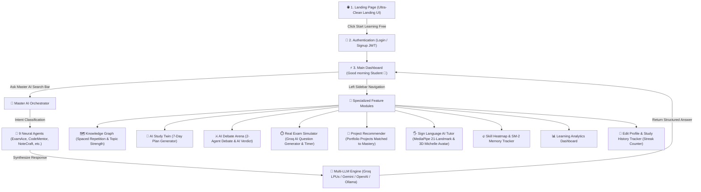

# EduVerse AI 🧠⚡
> **Ultra-Clean, Calm & Commercial-Grade SaaS Multi-Agent AI Learning Platform**

EduVerse AI is an autonomous, multi-agent artificial intelligence learning platform designed for computer science students, software engineering practitioners, and competitive examination candidates (GATE CS, DSA, Operating Systems, System Design).

Redesigned with a focus on **instant 3-second visual clarity**, users communicate with **One Master AI Assistant**, which dynamically understands intent, routes queries to 9 specialized neural agents, synthesizes responses, and manages a persistent **Personal Knowledge Graph** and **AI Spaced Repetition Memory**.

---

## 🔄 Complete End-to-End User Flow & Navigation



### 1-to-1 Step Walkthrough:
1. **Landing Page**: New visitors land on an ultra-clean page with high-impact value proposition (*"Master Any Subject with Autonomous AI Tutors"*), 3-step explainer, and 9-agent grid.
2. **Authentication**: Users sign in or register with JWT token authentication.
3. **Main Dashboard**: Greeted with personalized header (`Good morning, Student 👋`), central ChatGPT-style search bar, 9 active agent tags bar, and 4 primary action cards (*Generate Notes*, *Solve Doubt*, *Create Quiz*, *Study Plan*).
4. **Master AI Queries**: Asking any question routes to **Groq LPUs** (`llama-3.3-70b-versatile` at 500+ tokens/sec) or Gemini/OpenAI, synthesizing answers from the 9 neural agents.
5. **Specialized Modules**: One-click navigation via the left sidebar to access Sign AI gesture tracking, Knowledge Graph, Exam Simulator, SM-2 Spaced Repetition, and AI Debate Mode.

---

## 🎨 UI/UX Design System & 3-Second Clarity

The platform interface is engineered for maximum visual hierarchy, calm breathing room, and premium dark/light mode aesthetics:

- **Strict High-Contrast Theme Palette**:
  - **Light Mode**: Pure white / soft neutral background (`#FFFFFF` / `#FAFAFA`).
  - **Dark Mode**: Deep charcoal background (`#0A0A0A` / `#111111`) with zero blue tints.
- **Dynamic 9 Active Agents Bar**: Top status bar highlighting all 9 neural tutors with adaptive high-contrast text (`text-slate-800` Light / `text-neutral-100` Dark).
- **Sticky ChatGPT-Style Input Container**: Bottom search container with soft purple glow, prompt chips, voice mic, and global `⌘ + K` shortcut.

---

## 🌟 Key Unique Working Modules & Engines

Unlike standard LLMs (ChatGPT, Gemini, Claude) that reset context after every prompt, EduVerse AI features persistent, student-focused engines:

1. **⚡ Multi-LLM Provider Switcher & Groq LPU Engine**
   - Powered by ultra-fast **Groq LPUs (`llama-3.3-70b-versatile`)** running at 500+ tokens/sec for sub-second AI answers.
   - Switch seamlessly between **Groq LPUs**, **Google Gemini 1.5**, **OpenAI (GPT-4o)**, **DeepSeek (V3 / R1)**, and **Local Ollama** (100% offline & free).
   - Includes **Zero-Downtime Dynamic Fallback**: If network or API quota limits occur, the system smoothly falls back to internal dynamic solvers so demo presentations never crash.

2. **🔥 User Activity, Daily Streak & Study History Tracker**
   - **Daily Active Streak Counter**: Tracks consecutive study days (`🔥 7d Streak`) and total active days.
   - **Search & Study History Log**: Automatically logs every topic, code doubt, or sign query searched across Master AI and Sign AI.
   - **Redesigned User Profile Modal**: Edit username, academic level, target subject focus, choose from 5 avatar preset colors, and click **"Re-study"** on any past history item.

3. **🖐️ Sign Language AI Tutor & Text-to-Sign Translator (Deaf & Mute Accessibility)**
   - Real-time ASL (American Sign Language) recognition powered by MediaPipe 21-landmark tracking.
   - **Full ASL 26 Alphabet (A-Z)**: Gesture detection and WebGL 3D animation support for all 26 ASL alphabet signs.
   - **Text-to-Sign Translator**: Type any text or doubt (e.g. `"JAVA"`, `"DSA"`, `"OS"`) to animate the 3D Michelle Avatar step-by-step for each letter.
   - **Interactive Camera Zoom & Speed Controls**: Zoom buttons (**0.5x Full**, **1x Upper Body**, **1.5x Hands**) and Speed controls (**0.5x**, **1x**, **1.5x**, **2x**).

4. **⏱️ Real Exam Simulator with Subject Filtering & Groq AI Generation**
   - Select Exam Subject (*GATE CS & IT 2026*, *Data Structures & Algorithms*, *Operating Systems & Concurrency*, *DBMS & System Design*, *Computer Networks & Security*, *Python & Software Engineering*) and Difficulty Level.
   - **⚡ Groq AI Question Generator**: Click *"Generate New AI Questions"* to generate fresh, high-yield mock exam questions on demand via Groq LPUs.
   - Timed mock exam environment featuring live countdown timer and negative marking (`+4 / -1`).

5. **🧠 AI Learning Analytics & SuperMemo-2 (SM-2) Spaced Repetition Tracker**
   - **Productivity Index & Memory Telemetry**: Monitors study velocity, flashcard recall percentage, and mastered concepts.
   - **SM-2 Spaced Repetition Flashcard Engine**: Calculates memory forgetting curves using the SuperMemo-2 algorithm with interactive 3D flip card viewer and recall rating buttons (*Hard 1d*, *Good 3d*, *Easy 6d*).

6. **🗺️ Interactive Personal Knowledge Graph (100% Unrestricted)**
   - Live visual topography of mastered concepts, partial knowledge, and weak spots across 5 core CS domains (**DSA**, **Algorithms**, **Operating Systems**, **DBMS**, **System Design**).
   - Topic-level cards displaying: **Last Practiced Date**, **Next Revision Date (SM-2)**, **Related Concepts**, **Concept Strength %**, and **"Ask Master AI for Deep Dive Explanation"** (auto-navigates to Master AI Chat).

7. **📑 Interactive MCQ Quiz Game & Results Page**
   - **Game-like Experience**: One question at a time with instant correct (green) or wrong (red) option feedback.
   - **Results Page**: Score percentage, Grade Badges (*Excellent 🌟*, *Good 👍*, *Needs Improvement 💡*), and detailed question breakdown.

8. **🎙️ Master AI Voice (Full Voice Conversation)**
   - Hands-free, two-way voice communication powered by Speech-to-Text (`SpeechRecognition`) and Text-to-Speech (`SpeechSynthesis`). Features live interim transcript preview, voice selection, auto-voice toggle, and per-message answer playback.

9. **👤 AI Digital Study Twin & 7-Day Plan Generator**
   - Displays **Predicted Exam Mastery %**, **Learning Personality Profile**, and **Best Study Time Recommendation**.

10. **⚔️ AI Multi-Agent Debate Arena & Synthesis**
    - Two specialized AI agents debate opposing viewpoints in real-time with post-debate **AI Judgment Verdict**.

---

## 🤖 The 9 Specialized Neural Agents

EduVerse AI orchestrates 9 specialized agents working behind the Master AI Assistant:

1. **ExamAce AI**: Exam roadmap generator, PYQ analyzer, and high-yield scoring strategist.
2. **AssignMate AI**: Academic rewriter, plagiarism-aware paraphraser, and citation builder.
3. **ConceptClear AI**: Socratic problem solver, intuitive breakdown expert, and visual analogy builder.
4. **NoteCraft AI**: Automated markdown summary generator, cheat-sheet compiler, and mind-map creator.
5. **QuizMaster AI**: Adaptive MCQ generator powered by the SM-2 spaced repetition memory algorithm.
6. **StudyFlow AI**: Pomodoro timetable generator, exam countdown timer, and revision planner.
7. **PDFTutor AI**: Multi-document RAG assistant capable of parsing PDFs and answering cross-document queries.
8. **CodeMentor AI**: DSA sandbox, Big-O time & space complexity analyzer, and edge case finder.
9. **CareerPath AI**: ATS resume scanner, tech stack gap finder, and project portfolio builder.

---

## 🛠️ Complete Technical Architecture & Tech Stack

### 🎨 Frontend Stack
- **Core Framework**: React 18 + Vite + TypeScript (Strict Type Safety & Fast HMR)
- **Styling & Design System**: Vanilla CSS Design Tokens + TailwindCSS v4 (Custom dark mode palette `#0A0A0A` / `#111111`)
- **Icons & UI Components**: Lucide React Icons
- **Computer Vision & Gesture AI**: `@mediapipe/camera_utils` + `@mediapipe/hands` (MediaPipe 21-Landmark Hand Pose Classification)
- **3D Graphics & Sign Avatar**: Three.js + WebGL + GLTFLoader (Mixamo / ReadyPlayerMe 3D `.glb` model animation engine)
- **Speech Processing**: Web Speech API (`window.SpeechRecognition` & `window.SpeechSynthesis`)
- **State Management & Persistence**: React Context API (`AuthContext`), Custom Event Bus (`window.dispatchEvent`), LocalStorage Sync Services (`LLMService`, `UserActivityService`, `SignRecognitionService`)

### 🐍 Backend Stack
- **Framework**: Python 3.12 + Django 5 + Django REST Framework (DRF)
- **Authentication**: SimpleJWT (JSON Web Tokens) with refresh/access token lifecycle
- **Database**: PostgreSQL 16 with `pgvector` extension for AI vector embeddings and semantic search
- **Task Queue & Async Workers**: Redis 7 + Celery for background RAG processing and vector indexing
- **API Routing**: Django REST Framework ViewSets and Serializers (`/api/v1/auth/`, `/api/v1/master-ai/`, `/api/v1/knowledge-graph/`)

### ⚡ AI LLM Engine Architecture
- **Primary LLM Provider**: Groq LPUs (`llama-3.3-70b-versatile`, `mixtral-8x7b-32768`, `gemma2-9b-it`) — sub-second 500+ tokens/sec response latency
- **Secondary LLM Providers**: Google Gemini 1.5 Flash (`gemini-1.5-flash`), OpenAI (`gpt-4o`, `gpt-4o-mini`), DeepSeek (`deepseek-chat`, `deepseek-reasoner`), Local Ollama (`http://localhost:11434`)
- **Strategy Pattern Engine**: Clean OOP strategy interface (`ILLMProviderStrategy`) with runtime fallback & dynamic solver guarantees.

---

## 📁 Repository Directory Structure

```text
EduTech_Agents/
├── backend/                        # Django REST Framework Backend
│   ├── apps/                       # Modular Django Apps
│   │   ├── analytics/              # Quiz attempts & Study plans ORM models
│   │   ├── authentication/         # User auth & JWT handlers
│   │   ├── knowledge_graph/        # Concept nodes & edges ORM models
│   │   ├── learning_memory/        # Long-term memory & flashcards ORM models
│   │   └── master_ai/              # Master AI orchestration endpoint
│   ├── config/                     # Django settings & URL routing
│   └── manage.py                   # Django CLI tool
├── database/                       # Database Schemas & Migrations
│   └── schema/
│       └── 01_init_schema.sql      # PostgreSQL + pgvector SQL initialization script
├── deployment/                     # Docker & Infrastructure
│   └── docker/
│       └── docker-compose.yml      # Multi-container stack (Postgres + Redis + Django + Vite)
├── docs/                           # Software Architecture & Design Specs
│   └── DESIGN_SYSTEM_AND_ROADMAP.md
├── frontend/                       # Vite + React + TypeScript Frontend
│   ├── src/
│   │   ├── components/             # Reusable UI & Dashboard Components
│   │   │   ├── dashboard/          # KnowledgeGraph, AIDebate, ExamSimulator, MasterAIChat, UserProfileModal, ActiveAgentsBar, etc.
│   │   │   ├── SignAI/             # Webcam, RecognitionPanel, AvatarViewer, ChatWindow
│   │   │   └── landing/            # LearnWise-grade Landing Page components
│   │   ├── context/                # AuthContext & Session management
│   │   ├── services/               # LLMService, UserActivityService, MasterAIService, SignRecognitionService
│   │   └── pages/                  # LandingPage, DashboardPage, SignAIPage, LoginPage, SignupPage
│   └── package.json
└── README.md                       # Project Overview & Tech Stack Guide
```

---

## ⚡ Quick Start & Local Setup

### 1. Prerequisites
- Node.js 18+ & npm
- Python 3.10+
- PostgreSQL 15/16 (or Docker)

### 2. Frontend Setup
```bash
cd frontend
npm install
npm run dev
```
Access the application at `http://localhost:5173`.

### 3. Backend Setup
```bash
cd backend
python3 -m venv .venv
source .venv/bin/activate
pip install -r requirements.txt
python manage.py migrate
python manage.py runserver 8001
```
API endpoints are served at `http://localhost:8001/api/v1/`.

---

## 📜 License & Author

- **Author**: Rupesh Kumar Sah ([@rupeshsah86](https://github.com/rupeshsah86))
- **Repository**: [https://github.com/rupeshsah86/EduTech_Agents.git](https://github.com/rupeshsah86/EduTech_Agents.git)
