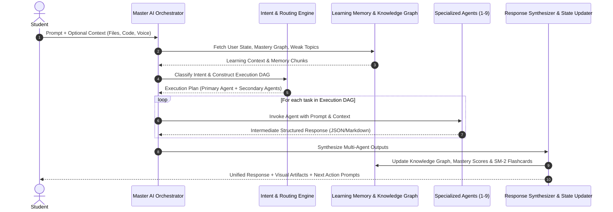

# EduVerse AI — System Architecture & Master Agent Orchestration

## 1. Vision & Core Philosophy

**EduVerse AI** is an enterprise-grade AI-powered learning ecosystem where **9 specialized AI agents** operate behind a single **Master AI Assistant**.

### Architectural Constraints
1. **Single Entry Point**: Students interact exclusively with the Master AI. They never see individual agent prompts, routing logic, or model dispatches.
2. **Intent & Dynamic Routing**: The Master AI analyzes intent, context, and learning history, routing tasks to one or more specialized agents.
3. **Multi-Agent Collaboration**: Complex requests trigger multi-agent workflows (e.g., PDF extraction -> Summary -> Adaptive Quiz -> Timetable scheduling).
4. **State Synthesis**: Every agent output is synthesized into a unified, high-quality response and persists to the user's **AI Learning Memory**, **Personal Knowledge Graph**, and **Skill Heatmap**.

---

## 2. Specialized Agents Breakdown

| Agent Name | Core Specialty | Key Capabilities |
| :--- | :--- | :--- |
| **Master AI** | Orchestration & Synthesis | Intent routing, context retrieval, multi-agent dispatch, response synthesis, state updating |
| **ExamAce AI** | Exam Prep & Revision | PYQs, exam countdown, topic importance scoring, memory revision strategy |
| **AssignMate AI** | Academic Writing Assistant | Draft generation, grammar polish, citation formatting (APA/IEEE/MLA), plagiarism check |
| **ConceptClear AI**| Socratic & Doubt Mastery | Step-by-step teaching, visual/analogy explanations, multi-level difficulty, Socratic dialogue |
| **NoteCraft AI** | Smart Notes & Mind Maps | PDF-to-notes, structured markdown, formula extraction, visual tree/mind-map generation |
| **QuizMaster AI** | Adaptive Evaluation | Adaptive MCQs, instant scoring, weak-topic detection, SM-2 spaced repetition flashcards |
| **StudyFlow AI** | Timetable & Productivity | AI timetable generation, Pomodoro scheduler, velocity tracking, productivity score |
| **PDFTutor AI** | Multi-Document RAG | PDF QA, key highlight extraction, multi-document cross-reasoning, formula parsing |
| **CodeMentor AI** | Coding & Interview Prep | Multi-language sandbox, DSA explanations, complexity analysis (Time/Space), interview simulation |
| **CareerPath AI** | Career Guidance & Resume | Resume ATS scanner, skill-gap analysis, mock interview simulator, salary insights |

---

## 3. Master AI Orchestration Engine Architecture

---

## 4. Technology Stack Specification

- **Frontend**: React 18, Vite, TypeScript, TailwindCSS, ShadCN UI, Framer Motion, React Query, Zustand.
- **Backend**: Python 3.11+, Django 5.0+, Django REST Framework, SimpleJWT, Celery, Redis.
- **Database**: PostgreSQL 16 with `pgvector` extension for vector embeddings & relational storage.
- **AI & Vector Layer**: Groq API (`llama-3.3-70b-versatile`, `mixtral-8x7b`), LangChain / LangGraph, Qdrant/PGVector.
- **Deployment**: Docker Compose, NGINX Reverse Proxy, Gunicorn, Uvicorn (ASGI for WebSockets).
