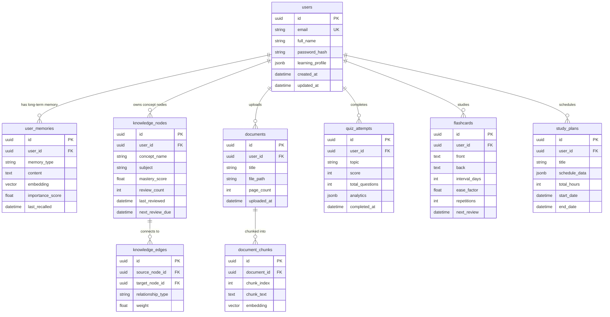

# EduVerse AI — Database Design & API Contracts

## 1. Database ER Diagram (PostgreSQL)

---

## 2. Core API Endpoints Specification

### Authentication API
- `POST /api/v1/auth/register/` — Register new user
- `POST /api/v1/auth/login/` — Login & receive JWT access + refresh tokens
- `POST /api/v1/auth/token/refresh/` — Refresh access token

### Master AI & Agent Orchestration API
- `POST /api/v1/master-ai/chat/` — Synchronous Master AI request (Payload: prompt, active_agent_override, uploaded_files)
- `GET /api/v1/master-ai/stream/` — WebSocket / SSE endpoint for streaming AI response & step-by-step agent activation state
- `GET /api/v1/master-ai/history/` — Fetch conversation trajectory & multi-agent execution logs

### Personal Knowledge Graph & Memory API
- `GET /api/v1/knowledge-graph/nodes/` — Get user's concept nodes & mastery levels
- `GET /api/v1/knowledge-graph/graph-data/` — Get full node + edge layout JSON for frontend Force-Graph visualizer
- `GET /api/v1/learning-memory/` — List recalled memories & learning style metrics
- `POST /api/v1/learning-memory/reconcile/` — Force update of skill heatmap & weak topic list

### Specialized Features API
- `POST /api/v1/pdf-tutor/upload/` — Upload document for PDFTutor RAG indexing
- `POST /api/v1/quiz/generate/` — Generate adaptive quiz (QuizMaster AI)
- `POST /api/v1/quiz/submit/` — Submit quiz attempt & auto-update SM-2 flashcards
- `POST /api/v1/code-mentor/execute/` — Execute code snippet safely in sandbox backend
- `POST /api/v1/career/resume-ats/` — Analyze PDF resume against target job description (CareerPath AI)
