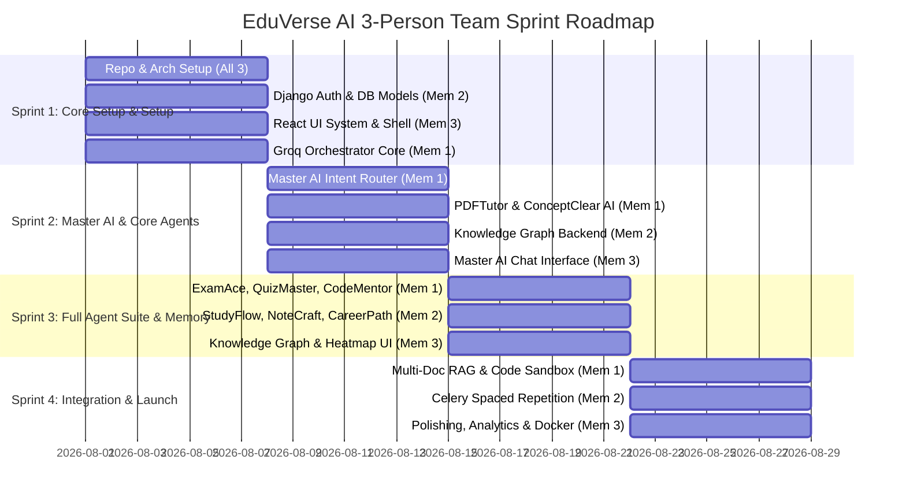

# EduVerse AI — UI Design System & 3-Person Team Sprint Roadmap

## 1. UI Design System & Aesthetics Specification

### Design Philosophy
Inspired by **Linear**, **Notion**, **Stripe**, **Apple**, and **OpenAI**:
- Dark Mode / Light Mode seamlessly integrated via Tailwind CSS variables.
- Glassmorphism overlays (`backdrop-blur-md`, subtle border highlights `border-white/10`).
- Vibrant gradients for AI agent indicators (e.g. Master AI = Purple-Cyan gradient, ExamAce = Amber-Red, CodeMentor = Emerald-Teal).
- Fluid animations powered by Framer Motion.

### Color Palette (Tailwind Tokens)
- **Background**: Dark `#0B0F17` / Light `#F8FAFC`
- **Card Surface**: Dark `#131B2E` (`bg-slate-900/60 backdrop-blur-lg`) / Light `#FFFFFF`
- **Border Accent**: Dark `#1E293B` (`border-slate-800`)
- **Primary Brand / Master AI**: `#6366F1` (Indigo 500) to `#A855F7` (Purple 500)
- **Agent Colors**:
  - ExamAce: `#F59E0B` (Amber)
  - AssignMate: `#EC4899` (Pink)
  - ConceptClear: `#3B82F6` (Blue)
  - NoteCraft: `#8B5CF6` (Violet)
  - QuizMaster: `#10B981` (Emerald)
  - StudyFlow: `#06B6D4` (Cyan)
  - PDFTutor: `#EF4444` (Red)
  - CodeMentor: `#14B8A6` (Teal)
  - CareerPath: `#F97316` (Orange)

---

## 2. 3-Person Team Sprint Roadmap

### Team Responsibilities Matrix

- **Member 1 (AI & Orchestration Specialist)**:
  - Master AI Intent Classification & Execution DAG Builder.
  - Integration of 9 Agent Prompts & Groq API handlers.
  - Vector Database / RAG pipeline for PDFTutor & AssignMate.

- **Member 2 (Backend & Database Engineer)**:
  - Django REST API & JWT Authentication.
  - PostgreSQL schema, `pgvector`, and Knowledge Graph node/edge REST endpoints.
  - Celery async tasks for background PDF parsing & SM-2 flashcard scheduling.

- **Member 3 (Frontend & UI/UX Engineer)**:
  - React + Vite + TypeScript application architecture.
  - Master AI Chat interface with agent execution indicators and stream rendering.
  - Interactive Knowledge Graph Visualizer (React Force Graph / D3), Skill Heatmap, and Code Sandbox UI.
